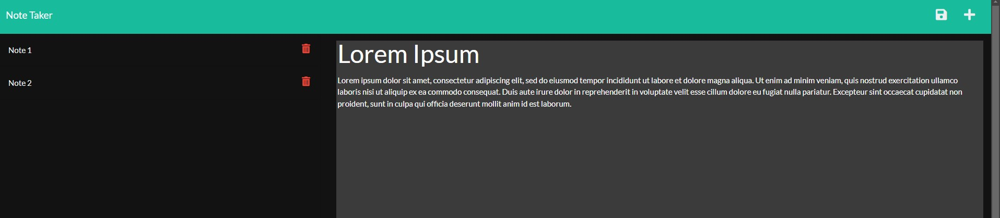
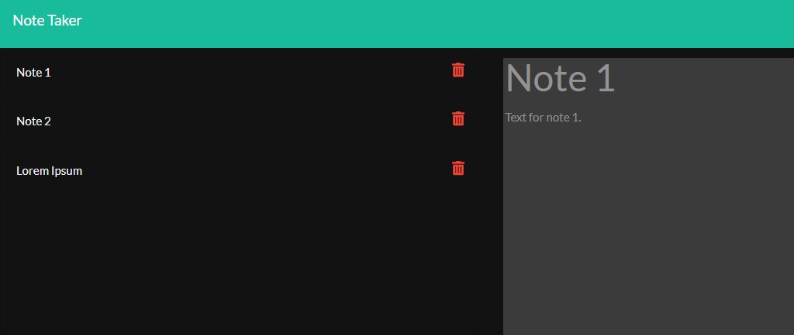

# Note Taker App
## ToC
- [Description](#description)
- [Features](#features)
- [Usage](#usage)
- [Preview](#preview)

## Description
Note Taker is an app that lets you create notes and store them into a database for further use.

## Features 
- Node.
- Express.
- UUID.
- Fs.

## Usage
Open command line and enter 'npm start', app would be located at port: 3001 for testing porpuses.

## Preview

